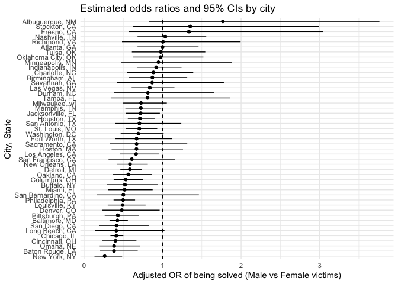
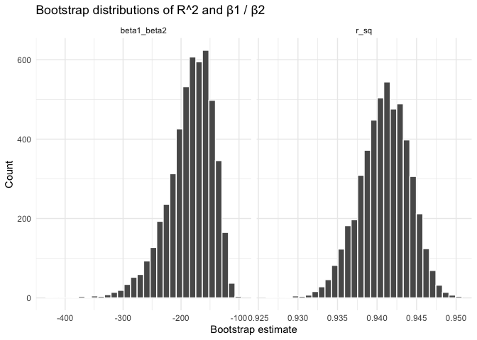
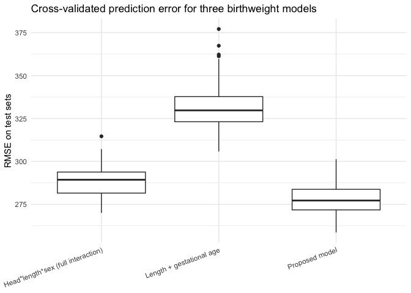

p8105_hw6_JH4977
================
jh4977
2025-12-01

# Q1

``` r
library(tidyverse)
```

    ## ── Attaching core tidyverse packages ──────────────────────── tidyverse 2.0.0 ──
    ## ✔ dplyr     1.1.4     ✔ readr     2.1.5
    ## ✔ forcats   1.0.0     ✔ stringr   1.5.1
    ## ✔ ggplot2   3.5.2     ✔ tibble    3.3.0
    ## ✔ lubridate 1.9.4     ✔ tidyr     1.3.1
    ## ✔ purrr     1.0.4     
    ## ── Conflicts ────────────────────────────────────────── tidyverse_conflicts() ──
    ## ✖ dplyr::filter() masks stats::filter()
    ## ✖ dplyr::lag()    masks stats::lag()
    ## ℹ Use the conflicted package (<http://conflicted.r-lib.org/>) to force all conflicts to become errors

``` r
library(broom)
library(purrr)
library(forcats)
library(ggplot2)

homicide_raw <- read_csv("data/homicide-data.csv")
```

    ## Rows: 52179 Columns: 12
    ## ── Column specification ────────────────────────────────────────────────────────
    ## Delimiter: ","
    ## chr (9): uid, victim_last, victim_first, victim_race, victim_age, victim_sex...
    ## dbl (3): reported_date, lat, lon
    ## 
    ## ℹ Use `spec()` to retrieve the full column specification for this data.
    ## ℹ Specify the column types or set `show_col_types = FALSE` to quiet this message.

``` r
homicide_df <- homicide_raw %>% 
  mutate(
    city_state = str_c(city, ", ", state),
    solved = if_else(disposition == "Closed by arrest", 1, 0),
    victim_age = as.numeric(victim_age),
    victim_sex = factor(victim_sex, levels = c("Female", "Male"))
  ) %>% 
  filter(victim_race %in% c("White", "Black")) %>% 
  filter(!city_state %in% c("Dallas, TX", "Phoenix, AZ", 
                            "Kansas City, MO", "Tulsa, AL")) %>% 
  filter(!is.na(victim_age))
```

    ## Warning: There was 1 warning in `mutate()`.
    ## ℹ In argument: `victim_age = as.numeric(victim_age)`.
    ## Caused by warning:
    ## ! NAs introduced by coercion

``` r
# for baltimore use glm
baltimore <- homicide_df %>% 
  filter(city_state == "Baltimore, MD")

baltimore_fit <- glm(
  solved ~ victim_age + victim_sex + victim_race,
  data   = baltimore,
  family = binomial()
)

# use broom to tidy the data and do CI and exp--OR
baltimore_or <- baltimore_fit %>% 
  tidy(conf.int = TRUE, exponentiate = TRUE) %>% 
  filter(term == "victim_sexMale") %>% 
  select(term, estimate, conf.low, conf.high)

baltimore_or
```

    ## # A tibble: 1 × 4
    ##   term           estimate conf.low conf.high
    ##   <chr>             <dbl>    <dbl>     <dbl>
    ## 1 victim_sexMale    0.426    0.324     0.558

``` r
# for other cities
# use nest to gather the data in each group and unest after running glm
city_results <- homicide_df %>% 
  group_by(city_state) %>% 
  nest() %>% 
  mutate(
    fit = map(
      data,
      ~ glm(solved ~ victim_age + victim_sex + victim_race,
            data = .x, family = binomial())
    ),
    tidied = map(fit, ~ tidy(.x, conf.int = TRUE, exponentiate = TRUE))
  ) %>% 
  unnest(tidied) %>% 
  filter(term == "victim_sexMale") %>% 
  select(city_state, estimate, conf.low, conf.high)

city_results
```

    ## # A tibble: 47 × 4
    ## # Groups:   city_state [47]
    ##    city_state      estimate conf.low conf.high
    ##    <chr>              <dbl>    <dbl>     <dbl>
    ##  1 Albuquerque, NM    1.77     0.825     3.76 
    ##  2 Atlanta, GA        1.00     0.680     1.46 
    ##  3 Baltimore, MD      0.426    0.324     0.558
    ##  4 Baton Rouge, LA    0.381    0.204     0.684
    ##  5 Birmingham, AL     0.870    0.571     1.31 
    ##  6 Boston, MA         0.667    0.351     1.26 
    ##  7 Buffalo, NY        0.521    0.288     0.936
    ##  8 Charlotte, NC      0.884    0.551     1.39 
    ##  9 Chicago, IL        0.410    0.336     0.501
    ## 10 Cincinnati, OH     0.400    0.231     0.667
    ## # ℹ 37 more rows

``` r
# order and plot
city_results %>% 
  ungroup() %>%                        
  ggplot(aes(x = reorder(city_state, estimate), 
             y = estimate)) +
  geom_point() +
  geom_errorbar(aes(ymin = conf.low, ymax = conf.high), width = 0) +
  geom_hline(yintercept = 1, linetype = 2) +
  coord_flip() +
  labs(
    x = "City, State",
    y = "Adjusted OR of being solved (Male vs Female victims)",
    title = "Estimated odds ratios and 95% CIs by city"
  ) +
  theme_minimal()
```

<!-- --> \##
Comment The cities are ordered by the adjusted odds ratio (OR) of a
homicide being solved for male victims relative to female victims. ORs
below 1 indicate that cases with male victims are less likely to be
solved than those with female victims, after adjusting for victim age
and race, whereas ORs above 1 indicate the opposite.

Overall, most cities have estimated ORs fairly close to 1 and many 95%
confidence intervals cross 1, suggesting little clear evidence of a
strong sex difference in case resolution in most locations. A few cities
at the top of the plot, such as Albuquerque, Stockton and Fresno, have
ORs above 1 with wide intervals, indicating a tendency toward higher
clearance for male victims but with substantial uncertainty. In
contrast, cities near the bottom, including New York and Baton Rouge,
have ORs below 1, suggesting that homicides involving male victims may
be somewhat less likely to be solved than those involving female
victims. However, given the wide intervals in many cities, these
apparent differences should be interpreted cautiously.

# Q2

``` r
library(purrr)
library(p8105.datasets)
data("weather_df")
```

``` r
# have a look
weather_fit <- lm(tmax ~ tmin + prcp, data = weather_df)
glance(weather_fit)
```

    ## # A tibble: 1 × 12
    ##   r.squared adj.r.squared sigma statistic p.value    df logLik    AIC    BIC
    ##       <dbl>         <dbl> <dbl>     <dbl>   <dbl> <dbl>  <dbl>  <dbl>  <dbl>
    ## 1     0.941         0.941  2.73    17245.       0     2 -5259. 10526. 10549.
    ## # ℹ 3 more variables: deviance <dbl>, df.residual <int>, nobs <int>

``` r
tidy(weather_fit)
```

    ## # A tibble: 3 × 5
    ##   term        estimate std.error statistic  p.value
    ##   <chr>          <dbl>     <dbl>     <dbl>    <dbl>
    ## 1 (Intercept)  7.78     0.0854       91.0  0       
    ## 2 tmin         1.02     0.00558     182.   0       
    ## 3 prcp        -0.00558  0.000593     -9.41 1.21e-20

``` r
boot_once <- function(df, i) {
  boot_df <- df %>% 
    slice_sample(n = nrow(df), replace = TRUE)  
  
  fit <- lm(tmax ~ tmin + prcp, data = boot_df)
  
  r_sq <- glance(fit)$r.squared
  
  coefs <- tidy(fit)
  beta1 <- coefs %>% filter(term == "tmin") %>% pull(estimate)
  beta2 <- coefs %>% filter(term == "prcp") %>% pull(estimate)
  
  tibble(
    replicate = i,
    r_sq = r_sq,
    beta1_beta2 = beta1 / beta2
  )
}

set.seed(1)

boot_results <- map_dfr(1:5000, ~ boot_once(weather_df, .x))

boot_results
```

    ## # A tibble: 5,000 × 3
    ##    replicate  r_sq beta1_beta2
    ##        <int> <dbl>       <dbl>
    ##  1         1 0.941       -202.
    ##  2         2 0.940       -222.
    ##  3         3 0.944       -166.
    ##  4         4 0.941       -228.
    ##  5         5 0.944       -149.
    ##  6         6 0.938       -172.
    ##  7         7 0.943       -181.
    ##  8         8 0.942       -229.
    ##  9         9 0.938       -152.
    ## 10        10 0.940       -205.
    ## # ℹ 4,990 more rows

``` r
boot_results %>% 
  pivot_longer(
    cols = c(r_sq, beta1_beta2),
    names_to = "stat",
    values_to = "value"
  ) %>% 
  ggplot(aes(x = value)) +
  geom_histogram(bins = 30, color = "white") +
  facet_wrap(~ stat, scales = "free_x") +
  labs(
    x = "Bootstrap estimate",
    y = "Count",
    title = "Bootstrap distributions of R^2 and β1 / β2"
  ) +
  theme_minimal()
```

<!-- -->

``` r
boot_results %>% 
  summarise(
    r_sq_lower  = quantile(r_sq, 0.025),
    r_sq_upper  = quantile(r_sq, 0.975),
    ratio_lower = quantile(beta1_beta2, 0.025),
    ratio_upper = quantile(beta1_beta2, 0.975)
  )
```

    ## # A tibble: 1 × 4
    ##   r_sq_lower r_sq_upper ratio_lower ratio_upper
    ##        <dbl>      <dbl>       <dbl>       <dbl>
    ## 1      0.934      0.947       -280.       -126.

## Comment

### Interpretation of bootstrap results

We fit the linear model $$
\texttt{tmax} = \beta_0 + \beta_1 \,\texttt{tmin} + \beta_2 \,\texttt{prcp} + \varepsilon .
$$

Using 5000 bootstrap samples, we obtained the bootstrap distributions of
the coefficient of determination $R^2$ and the ratio
$\hat{\beta}_1 / \hat{\beta}_2$, where $\hat{\beta}_1$ is the
coefficient for and $\hat{\beta}_2$ is the coefficient for .

The bootstrap distribution of $R^2$ is approximately symmetric and
highly concentrated. The 95% bootstrap confidence interval for $R^2$ is
roughly $(0.934,\; 0.947)$, indicating that the model explains a very
large and fairly stable proportion (about 94%) of the variability in
daily maximum temperature.

In contrast, the bootstrap distribution of
$\hat{\beta}_1 / \hat{\beta}_2$ is much more spread out and clearly
left–skewed. The 95% bootstrap confidence interval for this ratio is
extremely wide, from about $(-280,\; -126)$. Although the ratio is
consistently negative—suggesting that the effects of minimum temperature
and precipitation on $\texttt{tmax}$ act in opposite directions—the
large magnitude and width of this interval show that
$\hat{\beta}_1 / \hat{\beta}_2$ is estimated with substantial
uncertainty and is much less precisely determined than $R^2$.

# Q3

``` r
library(modelr)
```

    ## 
    ## Attaching package: 'modelr'

    ## The following object is masked from 'package:broom':
    ## 
    ##     bootstrap

``` r
birthweight <- read_csv("data/birthweight.csv")
```

    ## Rows: 4342 Columns: 20

    ## ── Column specification ────────────────────────────────────────────────────────
    ## Delimiter: ","
    ## dbl (20): babysex, bhead, blength, bwt, delwt, fincome, frace, gaweeks, malf...
    ## 
    ## ℹ Use `spec()` to retrieve the full column specification for this data.
    ## ℹ Specify the column types or set `show_col_types = FALSE` to quiet this message.

``` r
bw_df <- birthweight %>% 
  mutate(
    babysex = factor(babysex, levels = c(1, 2), labels = c("male", "female")),
    frace   = factor(frace),
    mrace   = factor(mrace),
    malform = factor(malform, levels = c(0, 1), labels = c("absent", "present"))
  )
# make sure no missing
sum(is.na(bw_df))
```

    ## [1] 0

``` r
# model building
bwt_mod_main <- lm(
  bwt ~ gaweeks + blength + bhead + babysex + 
    ppbmi + smoken + mrace + parity + malform,
  data = bw_df
)

summary(bwt_mod_main)
```

    ## 
    ## Call:
    ## lm(formula = bwt ~ gaweeks + blength + bhead + babysex + ppbmi + 
    ##     smoken + mrace + parity + malform, data = bw_df)
    ## 
    ## Residuals:
    ##     Min      1Q  Median      3Q     Max 
    ## -1118.7  -185.9    -7.8   176.3  2421.0 
    ## 
    ## Coefficients:
    ##                  Estimate Std. Error t value Pr(>|t|)    
    ## (Intercept)    -5869.0628   101.7491 -57.682  < 2e-16 ***
    ## gaweeks           12.6126     1.4849   8.494  < 2e-16 ***
    ## blength           78.5160     2.0340  38.602  < 2e-16 ***
    ## bhead            134.9657     3.4960  38.606  < 2e-16 ***
    ## babysexfemale     30.7819     8.6098   3.575 0.000354 ***
    ## ppbmi              5.1841     1.3400   3.869 0.000111 ***
    ## smoken            -4.3036     0.5949  -7.234 5.53e-13 ***
    ## mrace2          -141.4528     9.3754 -15.088  < 2e-16 ***
    ## mrace3          -102.9297    43.0226  -2.392 0.016778 *  
    ## mrace4          -139.3085    18.9824  -7.339 2.56e-13 ***
    ## parity           101.0736    41.0861   2.460 0.013931 *  
    ## malformpresent    26.2972    71.8633   0.366 0.714433    
    ## ---
    ## Signif. codes:  0 '***' 0.001 '**' 0.01 '*' 0.05 '.' 0.1 ' ' 1
    ## 
    ## Residual standard error: 277.5 on 4330 degrees of freedom
    ## Multiple R-squared:  0.7071, Adjusted R-squared:  0.7063 
    ## F-statistic: 950.1 on 11 and 4330 DF,  p-value: < 2.2e-16

``` r
bw_df %>% 
  add_predictions(bwt_mod_main) %>% 
  add_residuals(bwt_mod_main) %>% 
  ggplot(aes(x = pred, y = resid)) +
  geom_point(alpha = 0.3) +
  geom_hline(yintercept = 0, linetype = 2) +
  labs(
    x = "Fitted birthweight",
    y = "Residuals",
    title = "Residuals vs fitted values for proposed birthweight model"
  ) +
  theme_minimal()
```

<!-- --> \##
Comment I fit a multiple linear regression model for birthweight with
gestational age, birth length, head circumference, baby’s sex, maternal
pre-pregnancy BMI, smoking during pregnancy, maternal race, parity and
malformations as predictors. This set of variables is meant to capture
gestational development, fetal size and key maternal characteristics
related to birthweight. The model explains about 71% of the variation in
birthweight ($R^2 \approx 0.71$), and most main effects are
statistically significant in the expected directions.

The residuals–versus–fitted plot shows residuals roughly centered around
zero with no strong curvature, suggesting that a linear specification is
reasonable. There is some increase in variability at higher fitted
birthweights and a few outliers, but no severe violation of model
assumptions is apparent.

``` r
bwt_mod_len_ga <- lm(bwt ~ blength + gaweeks, data = bw_df)
summary(bwt_mod_len_ga)
```

    ## 
    ## Call:
    ## lm(formula = bwt ~ blength + gaweeks, data = bw_df)
    ## 
    ## Residuals:
    ##     Min      1Q  Median      3Q     Max 
    ## -1709.6  -215.4   -11.4   208.2  4188.8 
    ## 
    ## Coefficients:
    ##              Estimate Std. Error t value Pr(>|t|)    
    ## (Intercept) -4347.667     97.958  -44.38   <2e-16 ***
    ## blength       128.556      1.990   64.60   <2e-16 ***
    ## gaweeks        27.047      1.718   15.74   <2e-16 ***
    ## ---
    ## Signif. codes:  0 '***' 0.001 '**' 0.01 '*' 0.05 '.' 0.1 ' ' 1
    ## 
    ## Residual standard error: 333.2 on 4339 degrees of freedom
    ## Multiple R-squared:  0.5769, Adjusted R-squared:  0.5767 
    ## F-statistic:  2958 on 2 and 4339 DF,  p-value: < 2.2e-16

``` r
bwt_mod_interact <- lm(bwt ~ bhead * blength * babysex, data = bw_df)
summary(bwt_mod_interact)
```

    ## 
    ## Call:
    ## lm(formula = bwt ~ bhead * blength * babysex, data = bw_df)
    ## 
    ## Residuals:
    ##      Min       1Q   Median       3Q      Max 
    ## -1132.99  -190.42   -10.33   178.63  2617.96 
    ## 
    ## Coefficients:
    ##                               Estimate Std. Error t value Pr(>|t|)    
    ## (Intercept)                 -7176.8170  1264.8397  -5.674 1.49e-08 ***
    ## bhead                         181.7956    38.0542   4.777 1.84e-06 ***
    ## blength                       102.1269    26.2118   3.896 9.92e-05 ***
    ## babysexfemale                6374.8684  1677.7669   3.800 0.000147 ***
    ## bhead:blength                  -0.5536     0.7802  -0.710 0.478012    
    ## bhead:babysexfemale          -198.3932    51.0917  -3.883 0.000105 ***
    ## blength:babysexfemale        -123.7729    35.1185  -3.524 0.000429 ***
    ## bhead:blength:babysexfemale     3.8781     1.0566   3.670 0.000245 ***
    ## ---
    ## Signif. codes:  0 '***' 0.001 '**' 0.01 '*' 0.05 '.' 0.1 ' ' 1
    ## 
    ## Residual standard error: 287.7 on 4334 degrees of freedom
    ## Multiple R-squared:  0.6849, Adjusted R-squared:  0.6844 
    ## F-statistic:  1346 on 7 and 4334 DF,  p-value: < 2.2e-16

``` r
set.seed(1)

cv_df <- crossv_mc(bw_df, n = 100) 

cv_df <- cv_df %>% 
  mutate(
    train = map(train, as_tibble),
    test  = map(test,  as_tibble),
    
    mod_main     = map(train, ~ lm(
      bwt ~ gaweeks + blength + bhead + babysex +
        ppbmi + smoken + mrace + parity + malform,
      data = .x)),
    
    mod_len_ga   = map(train, ~ lm(bwt ~ blength + gaweeks, data = .x)),
    
    mod_interact = map(train, ~ lm(bwt ~ bhead * blength * babysex, data = .x)),
    
    rmse_main     = map2_dbl(mod_main,     test, ~ rmse(.x, .y)),
    rmse_len_ga   = map2_dbl(mod_len_ga,   test, ~ rmse(.x, .y)),
    rmse_interact = map2_dbl(mod_interact, test, ~ rmse(.x, .y))
  )
```

    ## Warning: There was 1 warning in `mutate()`.
    ## ℹ In argument: `rmse_main = map2_dbl(mod_main, test, ~rmse(.x, .y))`.
    ## Caused by warning in `predict.lm()`:
    ## ! prediction from rank-deficient fit; attr(*, "non-estim") has doubtful cases

``` r
cv_long <- cv_df %>% 
  select(starts_with("rmse_")) %>% 
  pivot_longer(
    cols = everything(),
    names_to = "model",
    values_to = "rmse"
  ) %>% 
  mutate(
    model = recode(model,
      rmse_main     = "Proposed model",
      rmse_len_ga   = "Length + gestational age",
      rmse_interact = "Head*length*sex (full interaction)"
    )
  )

cv_long %>% 
  ggplot(aes(x = model, y = rmse)) +
  geom_boxplot() +
  labs(
    x = NULL,
    y = "RMSE on test sets",
    title = "Cross-validated prediction error for three birthweight models"
  ) +
  theme_minimal() +
  theme(axis.text.x = element_text(angle = 20, hjust = 1))
```

<!-- -->

``` r
cv_long %>% 
  group_by(model) %>% 
  summarise(
    mean_rmse = mean(rmse),
    sd_rmse   = sd(rmse)
  )
```

    ## # A tibble: 3 × 3
    ##   model                              mean_rmse sd_rmse
    ##   <chr>                                  <dbl>   <dbl>
    ## 1 Head*length*sex (full interaction)      289.    9.22
    ## 2 Length + gestational age                332.   14.0 
    ## 3 Proposed model                          278.    8.08

## Comment

Using 100 Monte–Carlo cross-validation splits, the proposed model has
the smallest prediction error (mean RMSE ≈ 278), followed by the model
with head*length*sex interactions (mean RMSE ≈ 289). The simplest model
that uses only length and gestational age performs worst, with a much
larger mean RMSE (≈ 332) and higher variability. This suggests that
adding gestational, maternal and smoking covariates substantially
improves out-of-sample prediction of birthweight, while the more
complicated interaction model does not outperform the proposed model
despite its greater complexity.
